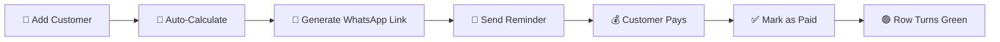

<div align="center">

# 💧 Water Can Payment Reminder System

### 100% Free Google Sheets Solution for Local Water Delivery Business

[](https://opensource.org/licenses/MIT)
[](https://sheets.google.com)
[](https://developers.google.com/apps-script)
[](https://wa.me)
[](https://github.com)
[](http://makeapullrequest.com)


**Streamline your water delivery business with automated payment tracking and WhatsApp reminders**

[📖 Documentation](#-documentation) • [🚀 Quick Start](#-quick-start) • [✨ Features](#-key-features) • [💡 Demo](#-how-it-works) • [🤝 Contributing](#-contributing)

---

</div>

## 📋 Table of Contents

- [Overview](#-overview)
- [Key Features](#-key-features)
- [Quick Start](#-quick-start)
- [How It Works](#-how-it-works)
- [Documentation](#-documentation)
- [Cost Comparison](#-cost-comparison)
- [Screenshots](#-screenshots)
- [FAQ](#-frequently-asked-questions)
- [Contributing](#-contributing)
- [License](#-license)

---

## 🎯 Overview

A **completely free** payment tracking and reminder system designed specifically for small water delivery businesses in India. Built with Google Sheets and Apps Script, this solution eliminates the need for expensive SMS APIs while providing professional-grade features.

### 🏆 Why Choose This System?

<table>
<tr>
<td width="25%" align="center">
<br>
<b>Zero Cost</b><br>
<sub>No setup fees, no monthly charges, no hidden costs</sub>
</td>
<td width="25%" align="center">
<br>
<b>Easy Setup</b><br>
<sub>3-minute setup, no coding knowledge required</sub>
</td>
<td width="25%" align="center">
<br>
<b>Mobile Ready</b><br>
<sub>Works seamlessly on phones, tablets, and computers</sub>
</td>
<td width="25%" align="center">
<br>
<b>Cloud Based</b><br>
<sub>Access from anywhere, automatic backups</sub>
</td>
</tr>
</table>

### 🎪 Perfect For

<table>
<tr>
<td align="center">💧<br><b>Water Delivery</b></td>
<td align="center">🥛<br><b>Milk Delivery</b></td>
<td align="center">📰<br><b>Newspaper</b></td>
<td align="center">🍱<br><b>Tiffin Service</b></td>
<td align="center">👕<br><b>Laundry</b></td>
</tr>
</table>

---

## ✨ Key Features

<table>
<tr>
<td width="50%">

### 💰 Cost & Accessibility
- ✅ **100% Free Forever** - No hidden costs
- ✅ **No Coding Required** - Beginner-friendly
- ✅ **Cloud-Based** - Access from anywhere
- ✅ **Mobile-Friendly** - Works on all devices

</td>
<td width="50%">

### 🚀 Automation & Efficiency
- ✅ **Auto-Calculations** - Instant amount totals
- ✅ **Smart Reminders** - Prevents duplicates
- ✅ **Bulk Operations** - Send multiple reminders
- ✅ **One-Click Reports** - Instant summaries

</td>
</tr>
<tr>
<td width="50%">

### 📱 WhatsApp Integration
- ✅ **Free Messaging** - No SMS charges
- ✅ **Pre-filled Messages** - Click and send
- ✅ **wa.me Links** - Official WhatsApp API
- ✅ **Works Everywhere** - Mobile & desktop

</td>
<td width="50%">

### 🎨 Visual Management
- ✅ **Color Coding** - Red (unpaid) / Green (paid)
- ✅ **Real-time Updates** - Instant visual feedback
- ✅ **Clean Interface** - Easy to understand
- ✅ **Professional Look** - Impress your customers

</td>
</tr>
</table>

## 🚀 Quick Start

### ⚡ 3-Minute Setup

<details>
<summary><b>📦 Method 1: Auto-Setup Script (Recommended)</b></summary>

1. Create a [new Google Sheet](https://sheets.google.com)
2. Go to **Extensions** → **Apps Script**
3. Copy code from [`WaterCanPaymentSystem_AutoSetup.gs`](WaterCanPaymentSystem_AutoSetup.gs)
4. Paste and click **Run** → Select `setupSheet`
5. Grant permissions
6. ✅ Done! Everything is configured automatically

</details>

<details>
<summary><b>🤖 Method 2: AI-Assisted Setup</b></summary>

1. Create a [new Google Sheet](https://sheets.google.com)
2. Open AI assistant (Gemini/Duet AI)
3. Copy prompt from [`AI_SETUP_PROMPT.txt`](AI_SETUP_PROMPT.txt)
4. Paste and let AI set up everything
5. ✅ Done!

</details>

<details>
<summary><b>📝 Method 3: Manual Setup</b></summary>

Follow the detailed guide in [`SETUP_INSTRUCTIONS.md`](SETUP_INSTRUCTIONS.md)

</details>

### 📚 What You Need

| Requirement | Details |
|------------|---------|
| 🌐 **Google Account** | Free Gmail account |
| 📱 **WhatsApp** | For sending reminders |
| ⏱️ **Time** | 3-10 minutes setup |
| 💻 **Device** | Computer, tablet, or phone |
| 🧠 **Skills** | None! Beginner-friendly |

---

## 💡 How It Works

### 🔄 Complete Workflow



### 📊 System Architecture

<table>
<tr>
<td width="33%" align="center">

#### 📥 Input Layer
**Google Sheets Interface**
- Customer data entry
- Manual status updates
- Date tracking

</td>
<td width="33%" align="center">

#### ⚙️ Processing Layer
**Apps Script Engine**
- Formula calculations
- Link generation
- Automation logic

</td>
<td width="33%" align="center">

#### 📤 Output Layer
**WhatsApp Integration**
- Pre-filled messages
- One-click sending
- Free delivery

</td>
</tr>
</table>

### 🎬 Usage Example

```
Day 1: Delivery
├─ Enter: Ramesh Kumar, 9876543210, 5 cans @ ₹20
├─ System calculates: ₹100
└─ Row turns RED (unpaid)

Day 2: Reminder
├─ Click: "Send Reminders to All Unpaid"
├─ System generates WhatsApp links
└─ Click link → Send message

Day 3: Payment
├─ Customer pays ₹100
├─ Change status to "Yes"
└─ Row turns GREEN (paid)

Day 4: Report
├─ Click: "Generate Payment Summary"
└─ View: Revenue, pending, collection rate
```

---

## 📚 Documentation

<table>
<tr>
<td align="center" width="25%">

### 📖 [README](README.md)
**Overview & Features**

Quick introduction and feature highlights

</td>
<td align="center" width="25%">

### 🚀 [Setup Guide](SETUP_INSTRUCTIONS.md)
**Step-by-Step Instructions**

Detailed setup with screenshots

</td>
<td align="center" width="25%">

### 📐 [Formulas](FORMULAS_REFERENCE.md)
**Technical Reference**

All formulas explained in detail

</td>
<td align="center" width="25%">

### 🧪 [Sample Data](SAMPLE_DATA.md)
**Testing & Examples**

Test data and usage scenarios

</td>
</tr>
</table>

### 📂 File Structure

```
Water-Can-Payment-System/
│
├── 📄 README.md                          # Project overview
├── 📘 SETUP_INSTRUCTIONS.md              # Detailed setup guide
├── 📗 FORMULAS_REFERENCE.md              # Formula documentation
├── 📙 SAMPLE_DATA.md                     # Test data & examples
├── 📕 MANUAL_SETUP_ALTERNATIVE.md        # Alternative methods
│
├── 💻 WaterCanPaymentSystem.gs           # Main Apps Script
├── 🤖 WaterCanPaymentSystem_AutoSetup.gs # Auto-setup version
│
├── 🤖 AI_SETUP_PROMPT.txt                # AI assistant prompt
└── ⚡ QUICK_START_GUIDE.txt              # Quick reference
```

---

## 📸 Screenshots

<details>
<summary><b>🖼️ View System Screenshots</b></summary>

### Customer Data Sheet


### WhatsApp Reminder


### Payment Summary Report


### Custom Menu


</details>

---

## 📱 Mobile Usage

### On Smartphone
1. Install Google Sheets app
2. Open your payment tracker
3. All features work on mobile
4. WhatsApp links open directly in app

### Offline Access
- Enable offline mode in Google Sheets
- View data without internet
- Sync when back online

---

## 💰 Cost Comparison

### 💸 Annual Cost Analysis

<table>
<tr>
<th>Solution</th>
<th>Setup Cost</th>
<th>Monthly Cost</th>
<th>Year 1 Total</th>
<th>Features</th>
</tr>
<tr>
<td><b>🎉 This System</b></td>
<td><b>₹0</b></td>
<td><b>₹0</b></td>
<td><b>₹0</b></td>
<td>✅ All features included</td>
</tr>
<tr>
<td>📱 Twilio SMS</td>
<td>₹0</td>
<td>₹500-2000</td>
<td>₹6,000-24,000</td>
<td>⚠️ Pay per message</td>
</tr>
<tr>
<td>📨 MSG91</td>
<td>₹0</td>
<td>₹300-1500</td>
<td>₹3,600-18,000</td>
<td>⚠️ Limited messages</td>
</tr>
<tr>
<td>💻 Custom Software</td>
<td>₹10,000+</td>
<td>₹1000-5000</td>
<td>₹22,000+</td>
<td>⚠️ Maintenance required</td>
</tr>
</table>

### 💡 Your Savings

<div align="center">

| Time Period | Savings vs SMS | Savings vs Software |
|-------------|----------------|---------------------|
| **1 Month** | ₹500-2,000 | ₹1,000-5,000 |
| **6 Months** | ₹3,000-12,000 | ₹6,000-30,000 |
| **1 Year** | ₹6,000-24,000 | ₹22,000+ |
| **3 Years** | ₹18,000-72,000 | ₹66,000+ |

</div>

---

## 🎓 Who Is This For?

### Perfect For:
- ✅ Small water delivery businesses
- ✅ Local can suppliers
- ✅ Home delivery services
- ✅ Businesses with 10-1000 customers
- ✅ Non-technical business owners
- ✅ Budget-conscious entrepreneurs

### Also Works For:
- Milk delivery
- Newspaper delivery
- Tiffin services
- Laundry services
- Any subscription-based local business

---

## 📖 Documentation

| Document | Purpose | Audience |
|----------|---------|----------|
| [README.md](README.md) | Overview & quick start | Everyone |
| [SETUP_INSTRUCTIONS.md](SETUP_INSTRUCTIONS.md) | Detailed setup guide | First-time users |
| [FORMULAS_REFERENCE.md](FORMULAS_REFERENCE.md) | Formula explanations | Technical users |
| [SAMPLE_DATA.md](SAMPLE_DATA.md) | Test data & examples | Testing & learning |

---

## ❓ Frequently Asked Questions

<details>
<summary><b>💵 Is this really 100% free?</b></summary>

Yes! Absolutely free forever. No hidden costs, no subscriptions, no trial periods. Google Sheets is free, Apps Script is free, and WhatsApp messages use your internet data (which you already have).

</details>

<details>
<summary><b>📱 Do customers need WhatsApp?</b></summary>

Yes, customers need WhatsApp installed to receive reminders. However, you can still track their payments in the sheet even without WhatsApp.

</details>

<details>
<summary><b>🤖 Are reminders sent automatically?</b></summary>

No. WhatsApp doesn't allow fully automated messages without their Business API (which is paid). This system generates pre-filled message links that you click to send. Still much faster than typing manually!

</details>

<details>
<summary><b>📊 How many customers can I track?</b></summary>

Google Sheets supports 10 million cells. You can easily track 10,000+ customers without any issues.

</details>

<details>
<summary><b>📱 Does it work on mobile?</b></summary>

Yes! Fully functional on Google Sheets mobile app (iOS & Android). All features work on phones and tablets.

</details>

<details>
<summary><b>🔒 Is my data secure?</b></summary>

Yes! Data is stored in your private Google account. Only you have access unless you explicitly share the sheet.

</details>

<details>
<summary><b>✏️ Can I customize the reminder message?</b></summary>

Absolutely! You can edit the message text in the formula or Apps Script code. Instructions provided in documentation.

</details>

<details>
<summary><b>🌐 Does it work offline?</b></summary>

You can view and edit data offline using Google Sheets offline mode. However, sending WhatsApp reminders requires internet connection.

</details>

<details>
<summary><b>🔄 Can I use this for other businesses?</b></summary>

Yes! This system works for any subscription or delivery-based business: milk delivery, newspaper, tiffin service, laundry, etc. Just modify the column names and message text.

</details>

<details>
<summary><b>🆘 What if I need help?</b></summary>

Check the comprehensive documentation files, use the in-sheet Help menu, or open an issue on GitHub. Community support is available!

</details>

---

## 🛠️ Customization Options

### Easy Customizations
- Change reminder message text
- Add more columns (delivery date, can type, etc.)
- Modify color scheme
- Add discount calculations
- Include GST/tax

### Advanced Customizations
- Email notifications (using Apps Script)
- Automatic monthly reports
- Integration with other Google services
- Custom payment terms
- Multi-location tracking

**👉 [Formula Reference](FORMULAS_REFERENCE.md) for customization examples**

---

## 🐛 Troubleshooting

### Common Issues

**WhatsApp link not working?**
- Check phone number is 10 digits
- Ensure Paid Status is "No"
- Remove spaces/dashes from phone number

**Formulas not calculating?**
- Check cells have data
- Ensure formula starts with `=`
- Verify column references

**Colors not showing?**
- Run: 💧 Water Can System → Refresh Conditional Formatting
- Check Paid Status has "Yes" or "No"

**Menu not appearing?**
- Refresh the page (F5)
- Re-run `onOpen` function in Apps Script
- Check script permissions

**👉 [Complete Troubleshooting Guide](SETUP_INSTRUCTIONS.md#-troubleshooting)**

---

## 🎯 Best Practices

### Daily Operations
1. Update Paid Status immediately when payment received
2. Send reminders weekly for unpaid customers
3. Check Payment Summary at end of day

### Weekly Tasks
1. Review all unpaid customers
2. Send bulk reminders
3. Follow up on overdue payments

### Monthly Tasks
1. Generate payment summary report
2. Download backup (File → Download → Excel)
3. Archive old paid records if needed

---

## 🌟 Success Stories

### Typical Results
- ⏱️ **Time Saved**: 2-3 hours per week on payment tracking
- 💰 **Cost Saved**: ₹500-2000 per month on SMS services
- 📈 **Collection Rate**: Improved by 20-30%
- 😊 **Customer Satisfaction**: Better communication

---

## 🤝 Contributing

We welcome contributions from the community! Here's how you can help:

<table>
<tr>
<td align="center" width="33%">

### 🐛 Report Bugs
Found an issue?
[Open an Issue](https://github.com/Maheswari-23/Water-Can-Payment-Tracker/issues)

</td>
<td align="center" width="33%">

### 💡 Suggest Features
Have an idea?
[Request Feature](https://github.com/Maheswari-23/Water-Can-Payment-Tracker/issues)

</td>
<td align="center" width="33%">

### 🔧 Submit PR
Want to contribute code?
[Create Pull Request](https://github.com/Maheswari-23/Water-Can-Payment-Tracker/pulls)

</td>
</tr>
</table>

### 📝 Contribution Guidelines

1. **Fork** the repository
2. **Create** a feature branch (`git checkout -b feature/AmazingFeature`)
3. **Commit** your changes (`git commit -m 'Add some AmazingFeature'`)
4. **Push** to the branch (`git push origin feature/AmazingFeature`)
5. **Open** a Pull Request

### 🌟 Contributors

Thanks to all contributors who help improve this project!

<a href="https://github.com/Maheswari-23/Water-Can-Payment-Tracker/graphs/contributors">
  
</a>

---

## 📜 License

This project is licensed under the **MIT License** - see the [LICENSE](LICENSE) file for details.

```
MIT License - Free to use, modify, and distribute
```

---

## 🙏 Acknowledgments

<div align="center">

Built with ❤️ for small business owners in India

### Powered By

<table>
<tr>
<td align="center">
<br>
<b>Google Sheets</b>
</td>
<td align="center">
<br>
<b>Apps Script</b>
</td>
<td align="center">
<br>
<b>WhatsApp</b>
</td>
<td align="center">
<br>
<b>Google Drive</b>
</td>
</tr>
</table>

### Special Thanks

- 🙏 Google for providing free cloud tools
- 💚 WhatsApp for wa.me API
- 🌟 Open source community
- 💼 Small business owners who inspired this project

</div>

---

## 📞 Support & Contact

<div align="center">

### Need Help?

📖 [Read Documentation](SETUP_INSTRUCTIONS.md) • 
💬 [Ask Questions](https://github.com/Maheswari-23/Water-Can-Payment-Tracker/discussions) • 
🐛 [Report Issues](https://github.com/Maheswari-23/Water-Can-Payment-Tracker/issues)

### Connect With Us

[](https://github.com/Maheswari-23)
[](https://linkedin.com)
[](https://twitter.com)

</div>

---

## ⭐ Show Your Support

If this project helped your business, please consider:

- ⭐ **Star this repository**
- 🔄 **Share with other business owners**
- 📝 **Write a testimonial**
- 🤝 **Contribute improvements**

---

## 📊 Project Stats

<div align="center">


</div>

---

<div align="center">

### 🎉 Ready to Transform Your Business?

**[📥 Download Now](https://github.com/Maheswari-23/Water-Can-Payment-Tracker/archive/refs/heads/main.zip)** • 
**[🚀 Get Started](SETUP_INSTRUCTIONS.md)** • 
**[📖 Read Docs](README.md)**

---

**Made with 💙 in India** • **Version 1.0** • **Last Updated: May 2026**

*Empowering small businesses with free, powerful tools* 🚀

</div>
